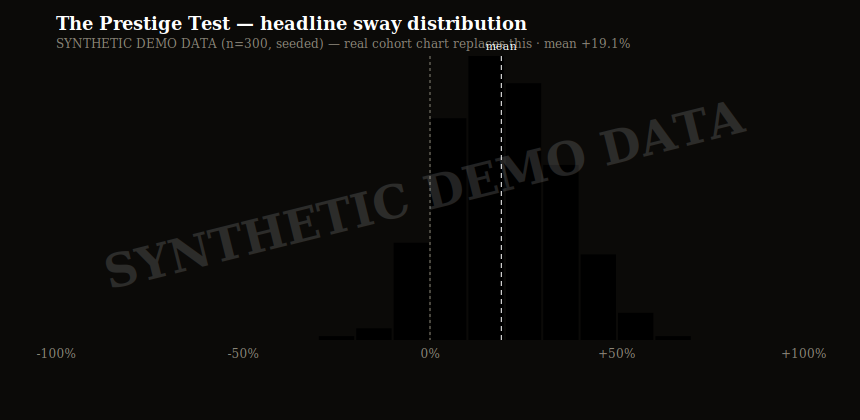
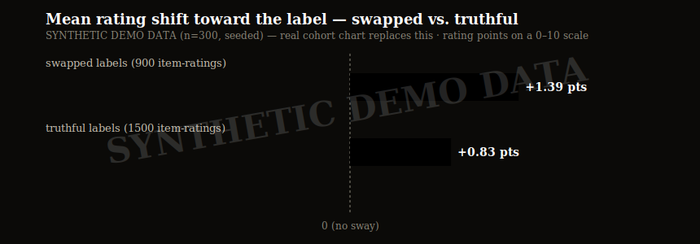
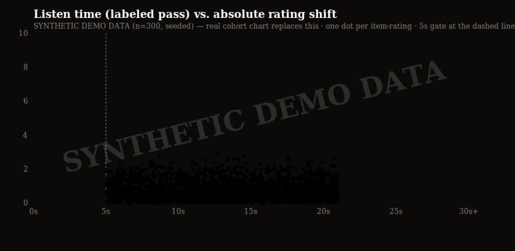

# Quantifying Hume's "Standard of Taste" — DRAFT v0.1 (launch write-up)

Status: SKELETON FINAL (2026-07-16 brief §3.E10; content still pre-publication). Charts are
WIRED: one command renders every fillable slot from a real export —
`node scripts/analysis/render-charts.mjs --in data/exports/bias-results-<date>.json`
(from `posthog-export.mjs --json`). Until cohort data lands, `--demo` renders the same files
watermarked SYNTHETIC (N3); the embedded paths below are stable either way. Target venues:
HN / r/datasets / r/musictheory. Voice: the write-up is technical and first-person-plural; the
product's Examiner voice stays in the product.

---

In 1757, David Hume wrote that a famous name gets to your judgment before your ears do — that
reputation can make a mediocre thing sound profound. He listed five things a good judge needs:
delicacy of taste, practice, comparison, freedom from prejudice, and good sense.

Two hundred and sixty-nine years later, we built a machine that measures the fourth one.

## The trick: you are your own control

Measuring "taste" usually collapses into self-report — which measures self-image, not taste. We
wanted a **performance task where you can be wrong**. The Prestige-Bias Test works like this:

1. You rate eight ~20-second clips **blind** (0–10, no names, no context).
2. You rate the **same eight clips again**, now with attributions and one-line reputations attached.
3. Your number is the mean signed movement of your ratings *toward* the labels.

The catch that makes it an experiment rather than a party trick: **three of the eight labels are
deliberately false.** A canonical Bach recording is presented as "M. Novak — home piano sessions."
A pleasant but modest catalog track gets festival acclaim. If your rating moves toward a label
that is a *lie*, no "the label gave me real information" defense survives — that movement is
prestige bias, isolated. Every deception is disclosed on a mandatory debrief screen, with the true
attribution, before anything is shareable. (The debrief turns out to be the best product moment,
not just the ethical requirement — "you re-rated the same clip 3 points higher because of a name
we invented" lands harder than any percentile.)

## What we measure (and what we refuse to claim)

- **Headline**: mean signed shift toward labels, as % of the rating scale.
  
- **Swapped-only shift**: the causally clean subset.
  
- **swayShare**: on how many *movable* clips (not already rated at the scale edge) you moved with
  the label — a consistency receipt that survives ceiling effects.
- **Listen-time gating**: the rating scale physically unlocks only after 5 seconds of actually-heard
  audio (media-clock, not wall-clock); per-item listen durations are logged. A 0.5-second rating is
  not a judgment of a stimulus.
  

What we do **not** do: percentiles before a norming cohort exists (every stat ships with a
"provisional — you're early" frame), personality inference of any kind, or LLM-generated scores.
The engine is ~200 lines of arithmetic with 465 tests; the share link carries your *raw ratings*
and every surface — page, OG card — recomputes from them, so a forged URL can only ever display
what the engine would truly conclude from those inputs.

## Design battles worth recording

- **Re-rate vs. matched sets.** Re-rating the same clips anchors people on their first answer, so
  our number *understates* true bias. The alternative (two "equivalent" clip sets) requires an
  equivalence claim we can't support without data — so we took the honest underestimate and said so.
- **The edge artifact.** If you rated a clip 10 blind, an acclaimed label can't move you up — decisive
  raters drift artificially toward "contrarian." We disclose the count and keep one statistic
  (swayShare) that excludes edge items entirely; the deeper correction waits for cohort data
  rather than being guessed at.
- **Licensing as a test suite.** All audio is public-domain / CC (Musopen's PD projects, the Open
  Goldberg Variations, CC-BY catalogs). Every item carries a captured license-proof page and a
  SHA-256 of the exact source file, and CI fails if either is missing. A pool version rides every
  share URL, so when items change, old links die gracefully instead of showing numbers computed
  against clips that were never rated.

## What's next

The visible-but-locked second machine tests Hume's *delicacy*: one of two clips has a controlled
defect (a buried wrong note, pitch drift, timing smear) — objectively correct answers, confidence
taps, and therefore calibration curves and Brier scores: Hume's "good sense" as a computed number.
Item-response theory over the accumulating response dataset turns the pool into a calibrated
instrument. [CHART: IRT item characteristic curves — waits for the delicacy battery; deliberately
NOT wired to a script yet, no instrument = no chart (N3)]

Take the test: **[URL at launch]** · Engine + item schema: **[repo URL when published]**
