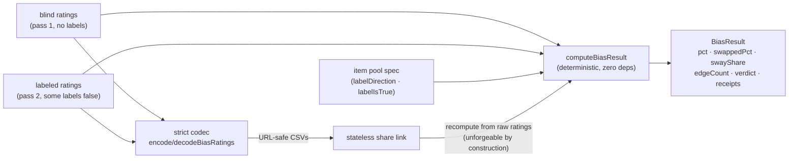

# hume-taste-engine

Deterministic instrument engine for **measuring taste** against David Hume's *Of the Standard of
Taste* (1757) — starting with the **Prestige-Bias Test**: rate stimuli blind, rate them again with
(sometimes deliberately false) labels attached, and the movement of your own ratings toward the
labels is the measurement. No ground-truth dataset required: **the rater is their own control.**

Extracted from [the Taste Gym](../../ARCHITECTURE.md), where it runs in production as the scoring
core of a hosted instrument. Pure TypeScript, zero dependencies, no I/O, no LLMs.

## The instrument in one paragraph

Each item carries a `labelDirection` ("up" = acclaimed label, "down" = dismissive) and a
`labelIsTrue` flag (false = the label is a deliberate swap). Given a blind pass and a labeled pass
of integer ratings (0–10), the engine computes: the mean signed shift **toward** each label
(headline `pct`), the same statistic over swapped items only (`swappedPct` — movement toward a
*false* label cannot be legitimate updating, so this is the causally clean subset), `swayShare`
(the fraction of *movable* items — those not already rated at the scale edge in the label's
direction — that moved with the label; immune to ceiling artifacts), a disclosed `edgeCount`, and
a provisional three-way verdict. A strict codec round-trips both rating passes through URL-safe
CSV, enabling **stateless, unforgeable share links**: any consumer recomputes from raw ratings, so
no URL can display a number the engine wouldn't conclude.

## How the pieces fit



## API

```ts
import {
  computeBiasResult,   // (instrumentId, items, blind, labeled) -> BiasResult
  encodeBiasRatings,   // (items, ratings) -> "5,7,3,..." (item order)
  decodeBiasRatings,   // strict inverse; null on ANY malformation
  BIAS_SCALE_MIN, BIAS_SCALE_MAX,
  type BiasItemSpec,   // { id, labelDirection: "up"|"down", labelIsTrue }
  type BiasRatings,    // Record<itemId, 0..10>
  type BiasResult,     // hash, pct, verdict, receipts, swappedPct, swayShare, edgeCount…
} from "hume-taste-engine";
```

Design contracts a pool should satisfy (enforced as tests in the reference app): ≥8 items, 2–3
swaps with at least one in each direction, |up − down| ≤ 2 so measured sway is the label effect
rather than generic second-pass drift.

## Honest-measurement notes

- Re-rating the same stimuli anchors raters: the measured sway **understates** the true effect.
- Items rated at the scale edge blind cannot move toward their label; `edgeCount` is surfaced and
  `swayShare` excludes them. Deeper corrections belong to a calibration pass with real cohort data.
- Verdict thresholds (±15%) are provisional constants, not empirical cut-points.

## Status

`0.1.0`, `private: true` — publication (repo/npm) pending owner approval. Source of truth remains
`src/engine/bias.ts` in the host app until first publish; the copies here must be kept in sync.

MIT © 2026 Siqi Wang
